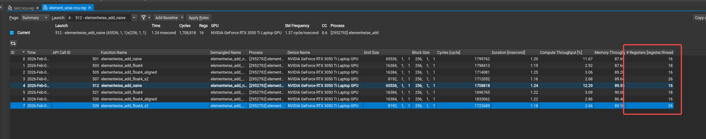

# ElementWise Add 算子性能分析

## 性能测试结果



## 使用 NVIDIA Nsight Compute 进行性能分析

```bash
sudo /usr/local/cuda/bin/ncu --set full -o element_wise.ncu-rep  /sandbox/CudaTrain/build/bin/elementwise_add
```

## 实现说明

本目录实现了多种版本的 ElementWise Add 算子：

1. **朴素版本** (`elementwise_add_naive`): 每个线程处理一个元素
2. **float4 向量化版本** (`elementwise_add_float4`): 每个线程处理 4 个元素，使用 float4 向量化
3. **float4 对齐版本** (`elementwise_add_float4_aligned`): 假设数据对齐，避免边界检查
4. **float4 x2 版本** (`elementwise_add_float4_x2`): 每个线程处理 8 个元素（2 个 float4）

## 为什么 float4_x2 版本更快？

`elementwise_add_float4_x2` 版本性能更好的主要原因：

### 1. **减少 Grid Size（线程块数量）**
- **float4 版本**: `gridSize = CEIL_DIV(n, 4 * 256) = CEIL_DIV(n, 1024)`
- **float4_x2 版本**: `gridSize = CEIL_DIV(n, 8 * 256) = CEIL_DIV(n, 2048)`
- **优势**: x2 版本的 grid size 是 float4 版本的一半，减少了 kernel 启动开销和线程块调度开销

### 2. **提高指令级并行（ILP）**
- 每个线程处理 2 个 float4（8 个元素），编译器可以更好地：
  - 隐藏内存访问延迟（在处理第一个 float4 时，可以预取第二个 float4）
  - 调度更多独立的指令，提高指令吞吐量
  - 减少指令依赖，提高流水线效率

### 3. **更好的内存访问模式**
- 连续处理 8 个元素（2 个 float4），可以：
  - 更好地利用 L1/L2 缓存局部性
  - 减少内存事务数量（每个线程处理更多数据）
  - 提高内存带宽利用率

### 4. **减少相对开销**
- 虽然都有边界检查，但 x2 版本：
  - 每个线程处理更多数据，边界检查的相对开销更小
  - 更少的线程意味着更少的 warp，减少调度开销
  - 减少分支发散的影响

### 5. **更好的 GPU 利用率**
- 对于内存密集型操作（如 elementwise add），瓶颈在内存带宽
- x2 版本通过减少线程数量但增加每线程工作量，在保持足够并行度的同时：
  - 减少了线程调度开销
  - 提高了每个线程的指令密度
  - 更好地平衡了计算和内存访问

### 性能对比示例（假设数据量 N = 16M）

| 版本 | Grid Size | 每线程工作量 | 相对性能 |
|------|-----------|--------------|----------|
| 朴素版本 | ~65K | 1 元素 | 基准 |
| float4 | ~16K | 4 元素 | 略快 |
| float4_x2 | ~8K | 8 元素 | **最快** |
